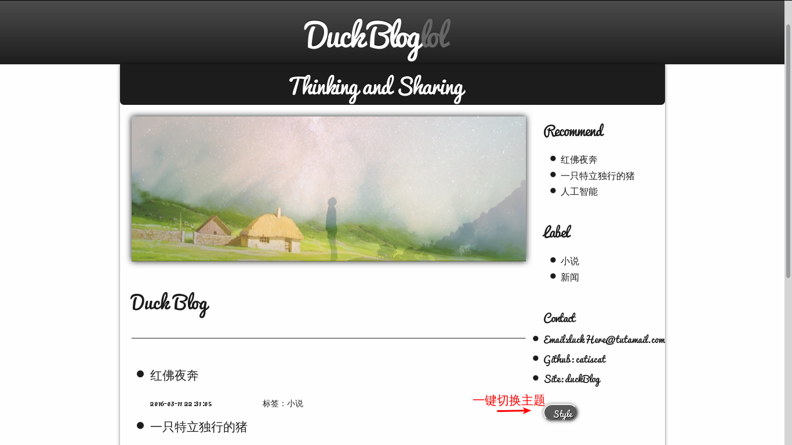
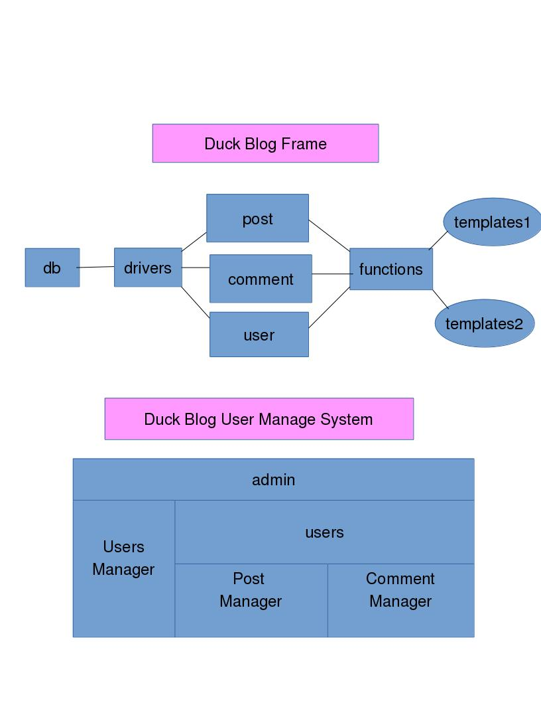

# [DogDuck Blog System](https://www.dogduck.lol)
##  [Preview](https://www.dogduck.lol)

 - A personal blog system.
 - Designed by myself without using any PHP framework.

# Features
- Personalized
- lightweight
- Scalable

In DogDuck Blog System, if you are a user, you can

- read posts
- publish comments
- switch themes with one key

If you are an admin,
apart from what is mentioned above,you can also
- manage comments
- manage posts
- manage users

Read the Reference Documents of DogDuck Blog System [Here](./docs/index.html).

# Frames
Frames here explain how DogDuck Blog System works.

> With  such Intelligible frames, just feel free to add extensions whatever you like.

# Usage
### 1  create your database

-    Find the file blog2.sql and copy all to your db shell to create database and tables for your blog.

### 2  set database param

-    Find the file SqlHelper.class.php,and set your values of these params, $dbname,$username,$password,$host.

### 3  enjoy your happy time

-    Push all these files to your server,and then just enjoy happy time to explore your personal blog with  DogDuck Blog System.

# About

 ###  DogDuck Blog System is highly Scalable, beacause

- #### High cohesion & Low Coupling

   - As you can see in the Frames, DogDuck Blog System works like a production line.There are five big Workshop,they are db, drivers,post/comment/user, functions, templates. Nonadjacent Workshops are Relatively independent.Which means when some files in one workshop changed,there is only one workshop which references it should be changed a little. As for other workshops, nothing to change, they just need to keep still. Beacuse all files are linear referenced in DogDuck Blog System.

- #### It is easy to add new themes

   - Just copy any one dir in contents/themes/  and change a little of html tags in several php file there. A new theme is born.

- #### It is easy to add new features

  - Just add a new function in utils/functions.php, and a new feature is created.

- #### It is easy to add new database

   - Just add a new php file in includes/drivers/  with the API provided by the includes/drivers/MySql/SqlHelper.class.php there.With this, you will own a new database.

- #### It is easy to add new users

    - You can add new users manually by copy a template.

 ###  DogDuck Blog System is safe, beacause

- #### All data input is cleaned.

    - There is a CleanData.class.php file to clean all the input data to make sure the basic safety of the blog system.

- #### Checkcode is required

    - checkcode is asked when adding comments and logining in. With this, there is no chance for Irrigation Robots when they want to do some destroy.

- #### Session is Request

    - When request of manager files are submit, only ones with correct login session info are given access to these manager files, which is safe for admin.

 ###  DogDuck Blog System is Readable,beacuse

 - #### The function names are regular and  meaningful

   - You can easily get features of these functions just by reading their names.

- #### With documentation for you

    - There is a documentation of DogDuck Blog System to help you quickly and easily understand how it works.

- #### All codes are neat and  ordered

# Version
1.0

