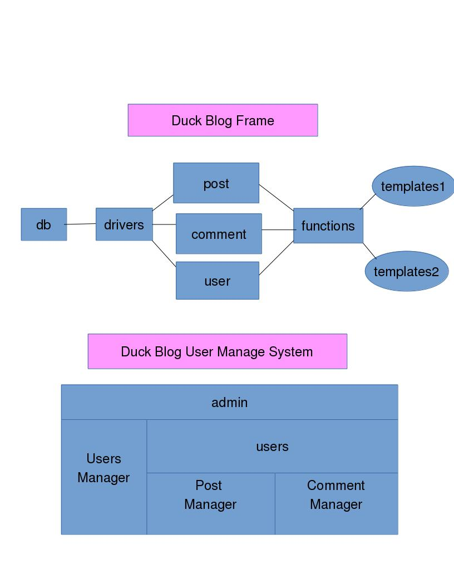

# DogDuck Blog System
[DogDuck Blog Preview](https://www.dogduck.lol).

 - A personal blog system for you.
 - Designed by myself without using any PHP framework.

# Features
- Personalized
- lightweight
- Scalable

In DogDuck Blog System, if you are a user, you can

- read posts
- publish comments
- switch themes with one key

If you are an admin, 
apart from what is mentioned above,you can also
- manage comments
- manage posts
- manage users

Read the Reference Documents of DogDuck Blog System [Here](./docs/index.html).

# Frames
Frames here explain how DogDuck Blog System works.

.

> With  such Intelligible frames, just feel free to add extensions whatever you like.

# Usage
### step1  create your database
 
-    Find the file blog2.sql and copy all to your db shell to create database and tables for your blog. 

### step2  set database param

-    Find the file SqlHelper.class.php,and set your values of these params, $dbname,$username,$password,$host.

### step3  enjoy your happy time

-    Push all these files to your server,and then just enjoy happy time to explore your personal blog with  DogDuck Blog System.

# Version 
1.0

